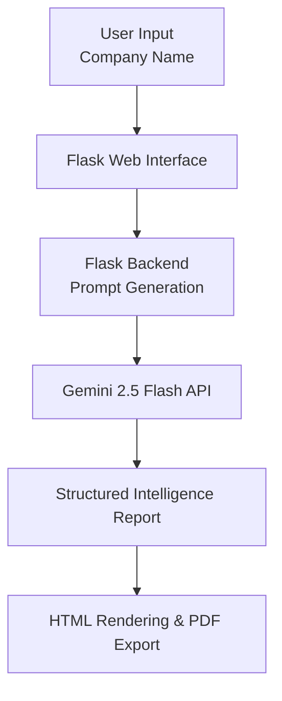

# AI Company Intelligence Agent

AI-powered company research and recommendation platform that generates structured business intelligence reports using Google's Gemini AI model.

The system analyzes a company and produces:

* Company Overview
* Key Business Information
* Potential Business Challenges
* AI Opportunities
* Personalized CEO Pitch

The objective is to help decision-makers identify business challenges and discover practical AI adoption opportunities.

---

## Badges


---

## Problem Statement

Organizations generate large amounts of public information, but manually researching companies, identifying operational challenges, and recommending AI solutions requires significant time and effort.

This project automates that process by generating structured company intelligence reports using Generative AI.

---

## Solution

The AI Company Intelligence Agent accepts a company name as input and generates a professional intelligence report containing:

* Company Overview
* Business Information
* Potential Challenges
* AI Recommendations
* Personalized Executive Pitch

The system uses prompt engineering and Gemini 2.5 Flash to analyze company information and generate business-focused recommendations .

---

## System Architecture


---

## Key Features

### Company Analysis

* Company Overview
* Industry Identification
* Geographic Presence
* Scale Assessment

### Business Intelligence

* Major Offerings
* Recent Developments
* Expansion Plans
* Important Public Information

### Challenge Identification

* Operational Bottlenecks
* Sales Challenges
* Customer Experience Challenges
* Business Risk Analysis

### AI Recommendations

* Company-Specific AI Opportunities
* Problem Identification
* AI Solution Recommendations
* Expected Business Impact

### Executive Insights

* Personalized CEO Pitch
* Business-Focused Recommendations
* Executive-Friendly Report Format

---

## Workflow

1. User enters a company name.
2. Flask receives the request.
3. A structured prompt is generated.
4. Gemini 2.5 Flash analyzes the company.
5. The report is generated in markdown format.
6. Markdown is converted into HTML.
7. The report is displayed in the web application.
8. Users can export the report as PDF.

---

## AI Tools Used

| Tool             | Purpose                                         |
| ---------------- | ----------------------------------------------- |
| Gemini 2.5 Flash | Company analysis and report generation          |
| ChatGPT          | Planning, debugging, and development assistance |
| Flask            | Backend framework                               |
| Markdown         | Report formatting                               |
| Render           | Cloud deployment                                |

---

## Tech Stack

| Layer           | Technology            |
| --------------- | --------------------- |
| Frontend        | HTML, CSS, JavaScript |
| Backend         | Flask                 |
| AI Model        | Gemini 2.5 Flash      |
| Deployment      | Render                |
| Version Control | GitHub                |
| Language        | Python                |

---

## Challenges Faced & Solutions

| Challenge                                                          | Solution                                                                                                                                                                 |
| ------------------------------------------------------------------ | ------------------------------------------------------------------------------------------------------------------------------------------------------------------------ |
| Generating company-specific and actionable insights instead of generic AI outputs | Used prompt engineering and structured report templates to guide Gemini into producing detailed business intelligence reports focused on company operations, industry context, challenges, and growth opportunities.                         |
| Identifying realistic business challenges                          | Applied reasoning-based analysis to infer operational, sales, and customer experience bottlenecks based on company characteristics and industry context.                 |
| Generating personalized AI recommendations                         | Created a framework that maps identified business challenges to practical AI use cases such as automation, analytics, customer engagement, and operational optimization. |
| Maintaining report consistency across different companies          | Implemented predefined report structures and section-based prompts to ensure every report follows the same professional format.                                          |
| Handling incomplete or uncertain company information               | Added fallback instructions that allow the system to make reasonable business assumptions while clearly avoiding unsupported claims.                                     |
| Handling API failures and quota limitations                        | Implemented exception handling and user-friendly error messages to prevent application crashes and improve reliability.                                                  |
| Balancing report quality and response time                         | Optimized prompts to generate detailed business insights while maintaining acceptable response times for users.                                                          |
| Deploying an AI-powered application securely                       | Used environment variables for API key management and deployed the application on Render using a production-ready configuration.                                         |

---

## Installation

### Clone Repository

```bash
git clone <repository-url>

```

### Create Virtual Environment

```bash
python -m venv .venv
```

Activate environment:

```bash
.venv\Scripts\activate
```

### Install Dependencies

```bash
pip install -r requirements.txt
```

### Configure Environment Variables

Create a `.env` file:

```env
GEMINI_API_KEY=your_api_key
```

### Run Application

```bash
python app.py
```

Application runs on:

```text
http://127.0.0.1:5000
```

---

## Deliverables

### Working Application

- Web-based Flask application
- Cloud deployed on Render

### Documentation

- Approach
- Architecture
- AI Tools Used
- Challenges Faced
- Solutions Implemented

### Demo Video

A walkthrough demonstrating:
- Product overview
- Workflow
- Reasoning
- Design decisions
  
---

### GitHub Repository

[GitHub Repository](https://github.com/joshiyashsh/AI-Company-Intelligence-Agent)

---

## Future Enhancements

* Real-time web research integration
* Multi-company comparison
* Report history management
* Database integration
* User authentication
* Advanced research agents
* RAG-based company intelligence

---

## Author

Yash Joshi

B.Tech Artificial Intelligence & Machine Learning